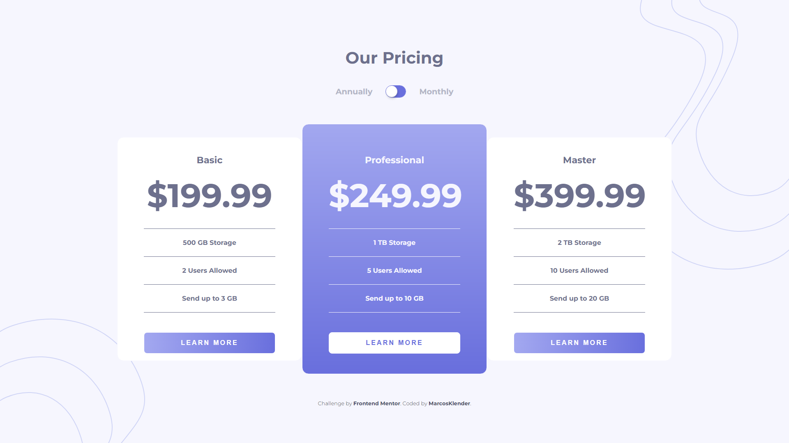

# Frontend Mentor - Pricing component with toggle solution

This is a solution to the [Pricing component with toggle challenge on Frontend Mentor](https://www.frontendmentor.io/challenges/pricing-component-with-toggle-8vPwRMIC). Frontend Mentor challenges help you improve your coding skills by building realistic projects. 

## Table of contents

- [Overview](#overview)
  - [Screenshot](#screenshot)
  - [Links](#links)
- [My process](#my-process)
  - [Built with](#built-with)
  - [Useful resources](#useful-resources)
- [Author](#author)

**Note: Delete this note and update the table of contents based on what sections you keep.**

## Overview

### Screenshot

### Links

- [Solution URL](https://www.frontendmentor.io/solutions/pricing-component-with-toggle-ARN_SiwXbT)
- [Live Site URL](https://marcosklender.github.io/Pricing-Component-With-Toggle/)

## My process

### Built with

- Semantic HTML5 markup
- CSS custom properties
- Flexbox
- CSS Grid
- Mobile-first workflow

### Useful resources

- [Display Text when Checkbox is Checked](https://www.w3schools.com/howto/howto_js_display_checkbox_text.asp)
- [Google Fonts](https://fonts.google.com/knowledge)

## Author

- Website - [MarcosKlender](https://www.marcosklender.com)
- Frontend Mentor - [@MarcosKlender](https://www.frontendmentor.io/profile/MarcosKlender)
- Twitter - [@MarcosKlender](https://www.twitter.com/MarcosKlender)